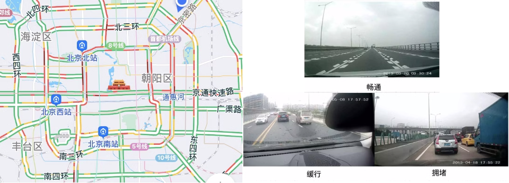
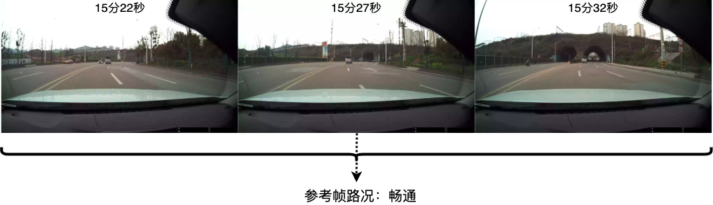

## 基于车载视频图像的动态路况分析数据集

### 描述

本数据集来自”阿里巴巴高德地图AMAP-TECH算法大赛-基于车载视频图像的动态路况分析“挑战赛：[https://tianchi.aliyun.com/competition/entrance/531809/information](https://tianchi.aliyun.com/competition/entrance/531809/information)，由阿里巴巴高德提供。

### 背景

---

高德地图每天会为用户提供海量的定位和路线导航规划服务，其所提供的路况状态信息（即道路交通是拥挤、缓行还是畅通）的准确性会影响到用户在出行过程中的决策和体验。传统的路况状态主要依靠驾车用户的轨迹信息生成。在用户少、驾驶行为异常的道路上，这种方法难以保证路况状态的准确性。

车载视频图像包含了更多的信息量，给了我们另外一个解决问题的视角。通过视频或图片，可以观察到路面的真实状态，包括机动车数量、道路宽度和空旷度等等。基于车载视频图像可以获取更准确的路况状态，为用户出行提供更高质量的服务。

算法研究人员可以通过计算机视觉等人工智能算法，基于视频图像中识别到的路面信息来判断道路通行状态，提高道路路况状态判断的准确性，从而提升高德地图用户的出行体验。


### 初赛数据集

---

#### 术语说明

路况：根据道路的平均车速、道路等级。对道路上车辆通行状态的描述，分为**畅通**、**缓行**、**拥堵**三个等级，在高德地图上显示为绿色、黄色、红色，如下图所示。



参考帧：存在图像序列内路况状态渐变的情况，每个图像序列存在一副参考帧图像，参考帧时刻的路况状态为该图像序列的真值路况状态。

#### 问题定义

- 输入：给定一组含有GPS时间的图像序列（包含3~5帧图像），其中一幅图像作为参考帧。
- 输出：以参考帧为准，输出该图像序列对应的路况状态（畅通、缓行和拥堵）。

如下图所示，该序列包含3帧图像，其中第3帧图像为参考帧。算法需要基于整个序列，推断路况状态。当图像序列内的路况状态不一致时，以参考帧为准。



图像序列由行车记录仪拍摄，路况真值（ground truth）是对应道路当前时刻真实的路况状态。大部分场景下，前方车辆的数量和密度决定了路况状态，但是也存在一些其他情况工参赛选手参考：

- 行驶道路存在大量路边停车，但不影响车辆行驶，实际路况状态为畅通。
- 跟车距离较近，前车遮挡视野内道路的情况，影响对当前路况的判断。
- 行驶在双向道路上，对向车道拥堵，形式车道路况状态为缓行或畅通。
- 相机安装存在角度偏差，可能会影响路况判断。

#### 数据说明

初赛数据集包括训练集和测试集。训练集合有1500个序列，共约7000幅图像；测试集合为600个序列，共约2800幅图像。预赛数据集包含不同等级的道路，包含高度路、城市快速路、普通道路等。路况真值类型的分布情况约为畅通70%、缓行10%、拥堵20%。路况真值主要基于参考帧标注。路面车辆较多的情况下，在标注时结合了序列中其他帧的信息。

#### 数据格式

数据组织是以图像序列为单位，每个文件夹包含参考帧和其前后相邻帧的图像序列，图像序列最多为5帧图像。

提供数据中包含以下信息：

- 图像序列的参考帧图像名
- 图像序列的路况
  - 0：畅通、1：缓行、2：拥堵、-1：测试集真值未给出
- 每帧图像采集时刻的GPS时间
  - 单位为秒。如GPS时间 1552806926 比 1552806921 滞后5秒钟

提供JSON格式标注文件，具体数据格式示意如下：

```json
{
    "annotations": [
        {
            "id": "000001",
            "key_frame": "2.jpg",
            "status": 0,
            "frames": [
                {
                    "frame_name": "1.jpg",
                    "gps_time": 1552806921
                },
                {
                    "frame_name": "2.jpg",
                    "gps_time": 1552806926
                },
                {
                    "frame_name": "3.jpg",
                    "gps_time": 1552806931
                },
                {
                    "frame_name": "4.jpg",
                    "gps_time": 1552806936
                }
            ]
        },
        {
            "id": "000002",
            "key_frame": "3.jpg",
            "status": 2,
            "frames": [
                {
                    "frame_name": "1.jpg",
                    "gps_time": 1555300555
                },
                {
                    "frame_name": "2.jpg",
                    "gps_time": 1555300560
                },
                {
                    "frame_name": "3.jpg",
                    "gps_time": 1555300565
                },
                {
                    "frame_name": "4.jpg",
                    "gps_time": 1555300570
                },
                {
                    "frame_name": "5.jpg",
                    "gps_time": 1555300580
                }
            ]
        }
    ]
}
```

#### 数据文件

- `amap_traffic_train`：训练集标注数据，以文件夹名称为`key`，内阁文件夹中包含一段3~5帧的jpg格式的图像序列，并按照顺序以1~5.jpg的顺序依次存放。
- [`amap_traffic_annotations_train.json`](./dataset/amap_traffic_annotations_train.json)：训练集标注数据，按照顺序依次存放，以文件夹名称为`key`，序列的标注为`value`，标注格式说明请查看“[数据格式](#数据格式)”部分。
- `amap_traffic_test`：初赛测试集视频序列。
- [`amap_traffic_annotations_test.json`](./dataset/amap_traffic_annotations_test.json)：初赛测试集待提交文件，其中标注`status`默认为-1，给出各序列关键帧信息。
